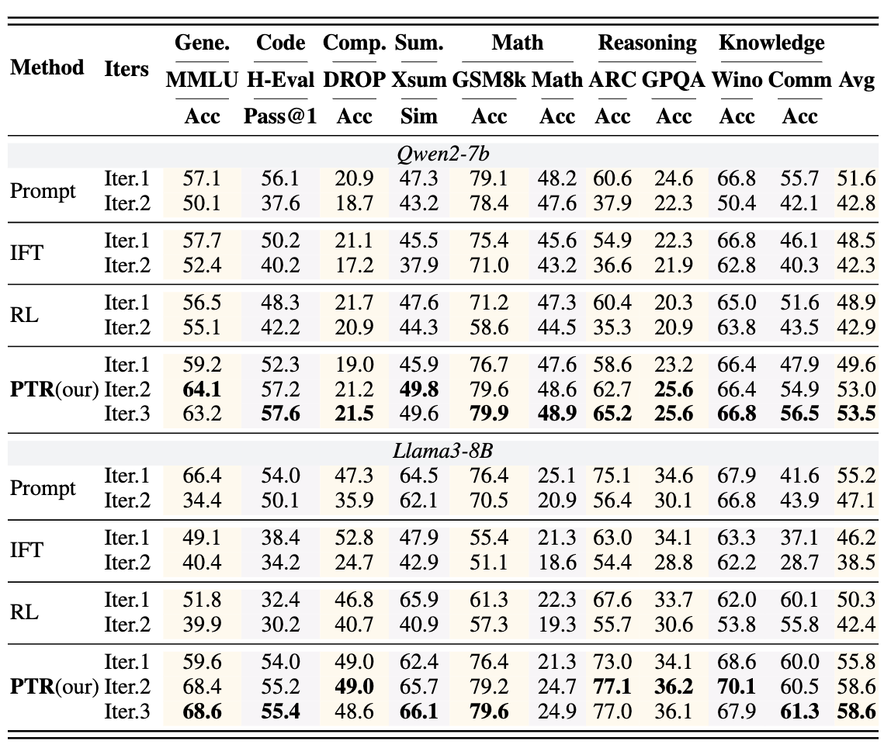

# Think Thrice Before You Act: Progressive Thought Refinement in Large Language Models

[[paper]](https://arxiv.org/abs/2410.13413) This paper proposes Progressive Thought Refinement (PTR), a two-phase framework enabling LLMs to self-refine responses iteratively. Phase one constructs thought-data via weak-strong model cooperation, and phase two employs weighted thought-mask fine-tuning for multi-iteration response enhancement. Experimental results affirm PTR's efficacy across ten tasks.


## NEWS
- 2025/01/23: This paper “Think Thrice Before You Act: Progressive Thought Refinement in Large Language Models” has been accepted to the 2025 conference. 

## Abstract
Recent advancements in large language models (LLMs) have demonstrated that progressive refinement, 
  rather than providing a single answer, results in more accurate and thoughtful outputs. 
  However, existing methods often rely heavily on supervision signals to evaluate previous responses, making it difficult to effectively assess output quality in more open-ended scenarios. Additionally, these methods are typically designed for specific tasks, which limits their generalization to new domains.
  To address these limitations, we propose Progressive Thought Refinement (PTR), a framework that enables LLMs to progressively refine their responses. PTR operates in two phases: 
  (1) Thought data construction stage: We propose a weak and strong model collaborative selection strategy to build a high-quality progressive refinement dataset to ensure logical consistency from thought to answers, and the answers are gradually refined in each round.
  (2) Thought-Mask Fine-Tuning Phase: 
        We design a training structure to mask the "thought" and adjust loss weights to encourage LLMs to refine prior thought, teaching them to implicitly understand "how to improve" rather than "what is correct."
        Experimental results show that PTR significantly enhances LLM performance across ten diverse tasks (avg. from 49.6\% to 53.5\%) without task-specific fine-tuning. 
        Notably, in more open-ended tasks, LLMs also demonstrate substantial improvements in the quality of responses beyond mere accuracy, suggesting that PTR truly teaches LLMs to self-improve over time.
      


## Requirements

**To run this project, you will need the following packages:**

```
 numpy==1.26.3
 tokenizers==0.15.0
 torch==2.1.2
 tqdm==4.66.1
 transformers==4.39.3
 vllm==0.3.2
```

## PTR Preparation

### Thought Generation

Save the script: Place the above content into a file named run_thought_generation.sh

```
#!/bin/bash

# Set default values for the arguments
MODEL_PATH="path/to/your/model"
MODEL_NAME="your_model_name"
OUTPUT_PATH="output"
USE_VLLM=false
USE_CPU=false
TEMPERATURE=1.0
TOP_P=1
TOP_K=-1
PROMPT_PATHS=("path/to/prompt1.jsonl" "path/to/prompt2.jsonl")
DATA_LEN=10000

# Parse command line arguments
while [[ "$#" -gt 0 ]]; do
    case $1 in
        --model_path) MODEL_PATH="$2"; shift ;;
        --model_name) MODEL_NAME="$2"; shift ;;
        --output_path) OUTPUT_PATH="$2"; shift ;;
        --use_vllm) USE_VLLM=true ;;
        --use_cpu) USE_CPU=true ;;
        --temperature) TEMPERATURE="$2"; shift ;;
        --top_p) TOP_P="$2"; shift ;;
        --top_k) TOP_K="$2"; shift ;;
        --prompt_paths) IFS=',' read -r -a PROMPT_PATHS <<< "$2"; shift ;;
        --data_len) DATA_LEN="$2"; shift ;;
        *) echo "Unknown parameter passed: $1"; exit 1 ;;
    esac
    shift
done

# Run the Python script with the specified arguments
python3 thought_generation_vllm.py \
    --model_path "$MODEL_PATH" \
    --model_name "$MODEL_NAME" \
    --output_path "$OUTPUT_PATH" \
    $( [ "$USE_VLLM" = true ] && echo "--use_vllm" ) \
    $( [ "$USE_CPU" = true ] && echo "--use_cpu" ) \
    --temperature "$TEMPERATURE" \
    --top_p "$TOP_P" \
    --top_k "$TOP_K" \
    --prompt_paths "${PROMPT_PATHS[@]}" \
    --data_len "$DATA_LEN"
```
#### Explanation of Parameters:
* `--model_path`: Path to your pre-trained language model
* `--model_name`: Name of your model (used for output file naming)
* `--output_path`: Directory where generated outputs will be saved
* `--use_vllm`: Flag to enable vLLM for faster inference
* `--use_cpu`: Flag to run inference on CPU instead of GPU
* `--temperature`: Sampling temperature (higher values = more random outputs)
* `--top_p`: Top-p sampling parameter (nucleus sampling)
* `--top_k`: Top-k sampling parameter (-1 to disable)
* `--prompt_paths`: One or more paths to JSONL files containing prompts
* `--data_len`: Maximum number of examples to process (default: 10000)


Grant execution permissions: Run the following command in the terminal to grant execution permissions to the script
```
chmod +x run_thought_generation.sh
```

Run the script: Use the following command to run the script
```
./run_thought_generation.sh \
  --model_path "your_model_path" \
  --model_name "your_model_name" \
  --prompt_paths ""
```


## PTR Fine-Tuning

### Encoder

You can run the encoder using the following script:

```
 cd /path/to/PTR_finetune
 python encoder/main.py \
     --tokenizer_path \
     --data_loader_path  \
     --corpus_name  \
     --encode_type qa \
     --output_path  \
     --max_length 4096 \
     --merge_data \
     --save_dtype int32 \
```

#### Explanation of Parameters:

* `--tokenizer_path`: Absolute path to the tokenizer
* `--data_loader_path`: Absolute path to your custom data_loader.py
* `--corpus_name`: Name of the encoded corpus, used for output folder naming
* `--encode_type`: "qa"
* `--output_path`: Absolute path to the output
* `--max_length`: Maximum length of each piece of data
* `--merge_data`: Whether to merge QA data
* `--save_dtype`: Data type of the saved file (either `int32` or `int16`)
* `--tokens_per_file`: Specifies the number of valid tokens per file (default: 5e8)

### Trainer

You can train the model using:

```
 cd /path/to/PTR_finetune
 
 deepspeed --include localhost:0 --master_port 12345 trainer/train.py \
     --model_path /path/to/your/model \
     --data_path /path/to/your/data \
     --save_name <your_model_name> \
     --output_path /path/to/your/output/path \
     --deepspeed_config_path /path/to/your/deepspeed_config.json \
     --max_epochs 3 \
     --save_epochs 1 \
     --save_steps 1000 \
```

#### Explanation of Training Parameters:

* `--model_path`: Path to the base model
* `--max_epochs`: Maximum number of epochs
* `--max_steps`: Maximum number of training steps
* `--load_ckpt_path`: Path to a checkpoint, if any
* `--data_path`: Root directory of the data path
* `--deepspeed_config_path`: Absolute path to `ds_config.json`
* `--output_path`: Path for saving outputs
* `--save_name`: Folder name for saving checkpoints
* `--save_steps`: Save checkpoints every N steps
* `--save_epochs`: Save checkpoints every N epochs
* `--save_optimizer`: Include optimizer state in saved checkpoints
* `--use_lora`: Use LoRA (Low-Rank Adaptation)
* `--lora_config_path`: Absolute path to `lora_config.json`

## Running Evaluations

This lightweight evaluation framework supports several commonly used benchmarks. It is highly extensible and can accommodate new tasks. The framework employs the `transformers` and `vllm` libraries for inference.

### Getting Started


**Configure the**`run.sh` script:

* **Model configuration:**`model_path`, `model_type`, `format_type`
* **Task configuration:**`tasks`, `config_path`, `data_path`
* **Output configuration:**`output_path`, `save_name`, etc.
* **Inference configuration:**`rounds`, `seed`, `temperature`, `top_p`, `top_k`, `max_new_tokens`

### Example: Evaluating Two Models on MMLU and GSM8K

```
 export CUDA_VISIBLE_DEVICES=3
 export TOKENIZERS_PARALLELISM=false
 
 declare -A models=(
    ["model_name1"]="model_path1"
 ["model_name2"]="model_path2"
 )
 
 for model_name in "${!models[@]}"; do
     model_path=${models[$model_name]}
     python main.py \
         --model_path "$model_path" \
         --model_type vllm \
         --format_type default \
         --tasks mmlu gsm8k \
         --save_name "$model_name" \
         --save_infer_texts \
         --save_infer_results \
         --config_path "config.json" \
         --output_path output/debug \
         --max_new_tokens 180 \
         --temperature 0 \
         --top_p 0.2 \
         --top_k 20 \
 done
```

### Configuring Evaluation Tasks

**The default**`config.json` file provides task configurations. An example configuration looks like:

```
 {
     "gsm8k": {
         "num_fewshots": 0,
         "limit": null
     },
     "mmlu": {
         "num_fewshots": 0,
         "limit": null
     }
 }
```
##  Experimental Results




Main experimental results about our approach and other baselines across various domains. We experiments on two difference structures LLMs( Qwen2-7b and Llama3-8B ).We also run 2 iteration on different baselines and 3 iteration on our approach.

It significantly enhances the model's ability to improve in subsequent iterations.


Qwen2-7B
- Accuracy:
  - Average accuracy improves from 49.6% to 53.5%
  - Improvement: 3.9%

Llama3-8B
- Accuracy:
  - Average accuracy improves from 55.8% to 58.6%
  - Improvement: 2.8%


## Project Members

This project is led by Dr. Jiaqing Liang and Professor Yanghua Xiao from KnowledgeWorks Lab, Fudan University. The core development team includes Master's student Chengyu Du, Ph.D. candidate Jinyi Han, and other contributors. We gratefully acknowledge their dedication to this work.


## Citation

If you find the code in our project useful, please consider citing our work as follows:

```
@misc{du2024thinkthriceactprogressive,
      title={Think Thrice Before You Act: Progressive Thought Refinement in Large Language Models}, 
      author={Chengyu Du and Jinyi Han and Yizhou Ying and Aili Chen and Qianyu He and Haokun Zhao and Sirui Xia and Haoran Guo and Jiaqing Liang and Zulong Chen and Liangyue Li and Yanghua Xiao},
      year={2024},
      eprint={2410.13413},
      archivePrefix={arXiv},
      primaryClass={cs.CL},
      url={https://arxiv.org/abs/2410.13413}, 
}
```
